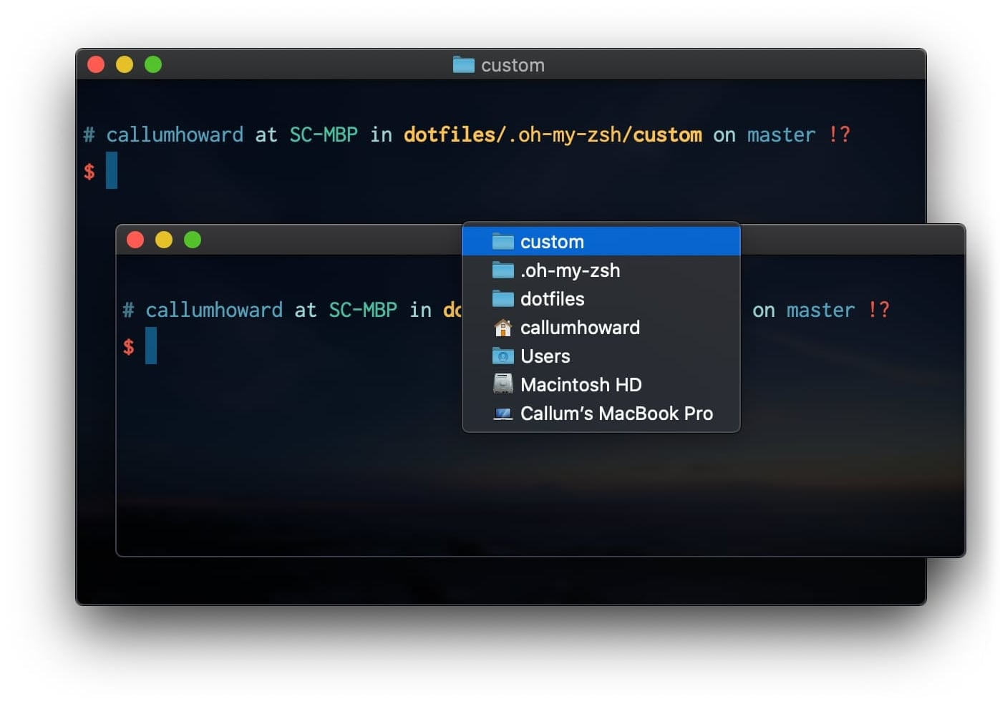

# Zsh Proxy Title for macOS Terminal

This plugin sets the icon in the title of a macOS Terminal window based on the current working directory.



## Installation

Install using your favourite Zsh plugin manager, or source this file from `~/.zshrc`.

### Oh-my-zsh

1. Clone this repository in oh-my-zsh's plugins directory:

```zsh
git clone https://github.com/CallumHoward/zsh-proxy-title.git ${ZSH_CUSTOM:-~/.oh-my-zsh/custom}/plugins/zsh-proxy-title.git
```

2. Activate the plugin in `~/.zshrc`:

```zsh
plugins=( [plugins...] proxy-title)
```

3. Restart zsh (such as by opening a new instance of your terminal emulator).

### Vim

It is also possible to set the proxy icon for the current file being edited in Vim. I will add it to this repo sometime in the future, but for now please refer to the snippet [here](https://github.com/CallumHoward/dotfiles/blob/48b633e735e60eeae62c2c76f199504f0963796b/.config/nvim/base.vim#L81-L102).

## Attribution

Special thanks to D Malam for the original Bash script.
